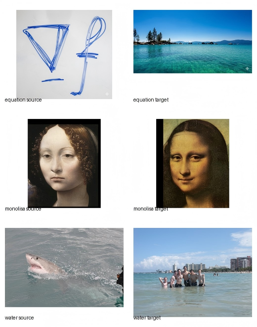

# Assignment 2 - DIP with PyTorch


### Resources:
- [Teaching Slides](https://pan.ustc.edu.cn/share/index/66294554e01948acaf78)
- [Paper: Poisson Image Editing](https://www.cs.jhu.edu/~misha/Fall07/Papers/Perez03.pdf)
- [Paper: Image-to-Image Translation with Conditional Adversarial Nets](https://phillipi.github.io/pix2pix/)
- [Paper: Fully Convolutional Networks for Semantic Segmentation](https://arxiv.org/abs/1411.4038)
- [PyTorch Installation & Docs](https://pytorch.org/)
- [Gradio: A useful web-based GUI toolkit](https://www.gradio.app/)

## Implementation of DIP with PyTorch

This repository is Yuxuan Song's implementation of Assignment_02 of DIP. The assignment contains two parts:

- Poisson Image Editing implemented with PyTorch tensor optimization.
- A fully convolutional encoder-decoder network for paired image translation on the Facades dataset.



## Requirements

To install requirements:

```setup
python -m pip install torch torchvision opencv-python numpy pillow gradio tqdm matplotlib
```

The Poisson blending program can run on CPU, but CUDA is recommended because the optimization loop updates the whole blended image for 5000 iterations.

## Running

To run Poisson Image Editing, run:

```poisson
python run_blending_gradio.py
```

The Gradio interface supports the following workflow:

- Upload a foreground image and a background image.
- Click several points on the foreground image to define a polygon region.
- Click `Close Polygon` after selecting at least three points.
- Adjust the horizontal and vertical offsets with the sliders.
- Click `Blend Images` to optimize and display the final result.

To run Pix2Pix-style image translation, run:

```pix2pix
cd Pix2Pix
bash download_facades_dataset.sh
python train.py
```

The training script downloads the Facades dataset, generates `train_list.txt` and `val_list.txt`, trains the model, saves visualization images every 5 epochs, and saves checkpoints every 50 epochs.

## Method

### Poisson Image Editing

The Poisson blending implementation is in `run_blending_gradio.py`. The core idea is to preserve the foreground gradient field inside the selected region while allowing the pasted area to match the target background boundary.

The polygon mask is generated by `create_mask_from_points`. The selected polygon vertices are converted to integer pixel coordinates, rasterized with `PIL.ImageDraw.Draw.polygon`, and stored as a binary mask where pixels inside the polygon are 255 and outside pixels are 0.

During blending, the same polygon is used twice:

- `foreground_mask` marks the selected region in the foreground image.
- `background_mask` marks the shifted target region in the background image after adding `(dx, dy)` to all polygon vertices.

The input images and masks are converted to PyTorch tensors. The blended image is initialized from the background image, and the target region is initialized as a weighted mixture of 90% background and 10% foreground. This gives the optimization a stable starting point while still keeping the target image as the dominant initial appearance.

The Laplacian loss is computed with a depth-wise 2D convolution using the kernel:

```text
0   1   0
1  -4   1
0   1   0
```

The kernel is repeated for all RGB channels and applied with `groups=channels`, so each color channel is convolved independently. The loss compares the Laplacian response of the foreground region and the blended target region:

```python
loss = F.mse_loss(blended_laplacian, foreground_laplacian)
```

Only pixels inside the selected masks participate in the loss. The foreground Laplacian is detached from the computation graph, while the blended image is optimized directly with Adam. The code performs 5000 optimization steps with an initial learning rate of `1e-2`, then decreases the learning rate by 10 times after two thirds of the iterations. Finally, the optimized image is clamped to `[0, 1]` and converted back to an 8-bit image.

### Pix2Pix-Style Fully Convolutional Network

The Pix2Pix part is implemented in the `Pix2Pix/` folder. The model is defined in `FCN_network.py` as a fully convolutional encoder-decoder network with skip connections.

The encoder contains five convolution blocks:

- `3 -> 64`
- `64 -> 128`
- `128 -> 256`
- `256 -> 512`
- `512 -> 512`

Each block uses a `4x4` convolution with stride `2` and padding `1`, followed by batch normalization and ReLU. These layers downsample the input image while increasing the feature dimension.

The decoder uses transposed convolutions to recover the spatial resolution. Skip connections concatenate decoder features with encoder features of the same resolution, following a U-Net style design. The final layer maps the feature map back to 3 RGB channels and uses `Tanh`, so the output range is `[-1, 1]`.

The dataset loader in `facades_dataset.py` reads paired Facades images. Each image is normalized from `[0, 255]` to `[-1, 1]`, then split horizontally:

- The left half `image[:, :, :256]` is used as the RGB input.
- The right half `image[:, :, 256:]` is used as the semantic/target image.

The training script in `train.py` uses:

- Batch size: `100`
- Loss: `L1Loss`
- Optimizer: Adam
- Learning rate: `0.001`
- Betas: `(0.5, 0.999)`
- Epochs: `300`
- Scheduler: `StepLR(step_size=200, gamma=0.2)`

During training, the script saves input-target-output comparisons every 5 epochs to `train_results/` and `val_results/`. Model checkpoints are saved every 50 epochs to `checkpoints/`.

## Results

### Poisson Image Editing

The repository provides three Poisson blending image pairs:

- `data_poisson/equation`
- `data_poisson/monolisa`
- `data_poisson/water`

The Gradio interface allows selecting arbitrary source regions and placing them on the target image. Compared with direct copy-paste, the optimized result better preserves local source texture while reducing obvious boundary discontinuities. This is because the objective matches Laplacian responses rather than raw RGB values, so the pasted region follows the foreground gradient structure while adapting more naturally to the target background.


For high-contrast examples such as the equation image or shark image, the method can preserve strong edges inside the selected polygon. For portrait-like examples such as the Mona Lisa pair, the blended result is smoother, but color mismatch may still be visible if the selected region and target region have very different illumination.

### Pix2Pix-Style Image Translation

The implemented network can learn a paired image-to-image mapping from the Facades dataset. The saved comparison images concatenate:

```text
input | target | output
```

The fully convolutional structure makes the model suitable for dense prediction tasks. Skip connections help preserve low-level spatial information, while the bottleneck layers capture higher-level structure. Since the current implementation uses only an L1 reconstruction loss and does not include a discriminator, it is more accurately a supervised U-Net/FCN baseline inspired by Pix2Pix rather than a complete conditional GAN. As a result, the output is expected to recover the main layout and colors, but fine texture and sharp boundaries may be smoother than a full Pix2Pix model trained with adversarial loss.

## Analysis

### Poisson Blending Analysis

The Poisson part demonstrates that image editing can be formulated as an optimization problem. Instead of directly copying RGB values from the foreground, the algorithm optimizes target pixels so that their Laplacian response matches the source region. This makes the transition near the boundary less abrupt and helps preserve source image details.

The quality of the result depends on the selected mask. A tight mask around the object usually produces cleaner results, while a mask containing too much irrelevant background can introduce unwanted gradients. If the shifted polygon goes outside the target image, the number of valid foreground and background mask pixels may differ, so the implementation uses the minimum valid count when computing the loss.

### Pix2Pix Analysis

The Pix2Pix part shows how a fully convolutional neural network can be used for paired image translation. The encoder compresses the input into abstract features, and the decoder reconstructs an output image. Skip connections are important because they pass local structure directly from the encoder to the decoder, reducing information loss caused by repeated downsampling.

The current training setup is simple and stable because it uses L1 loss. However, L1 loss tends to average plausible outputs, which can make generated images blurry. A complete Pix2Pix implementation could add a PatchGAN discriminator and combine adversarial loss with L1 loss:

```text
total_loss = GAN_loss + lambda * L1_loss
```

Additional improvements include using data augmentation, smaller batch sizes for limited GPU memory, LeakyReLU in the encoder, dropout in the decoder, and longer training on a larger paired dataset.

## Acknowledgement

> Thanks for the algorithms proposed by [Poisson Image Editing](https://www.cs.jhu.edu/~misha/Fall07/Papers/Perez03.pdf), [Image-to-Image Translation with Conditional Adversarial Nets](https://phillipi.github.io/pix2pix/), and [Fully Convolutional Networks for Semantic Segmentation](https://arxiv.org/abs/1411.4038).
